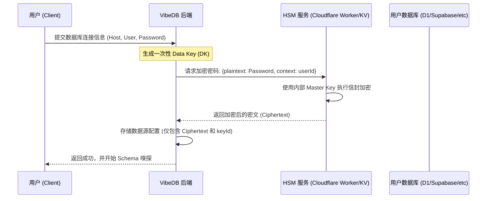
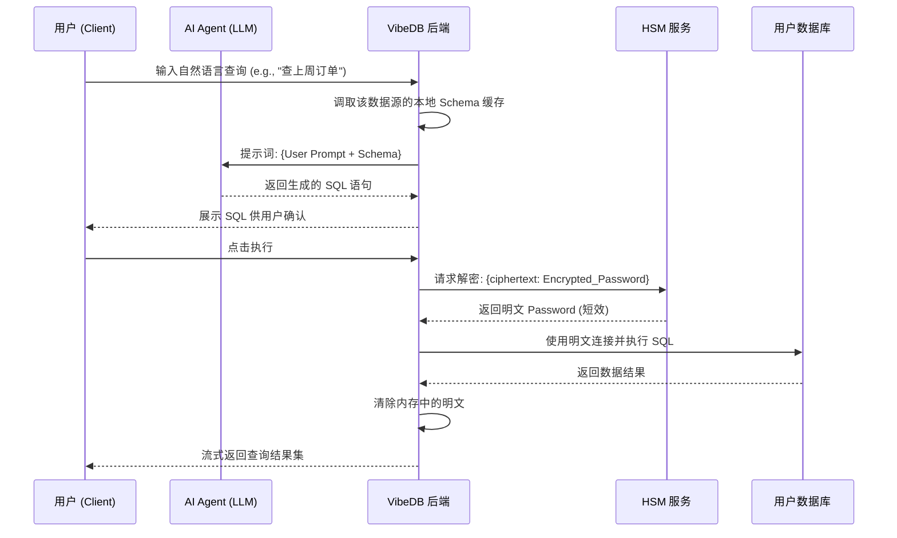
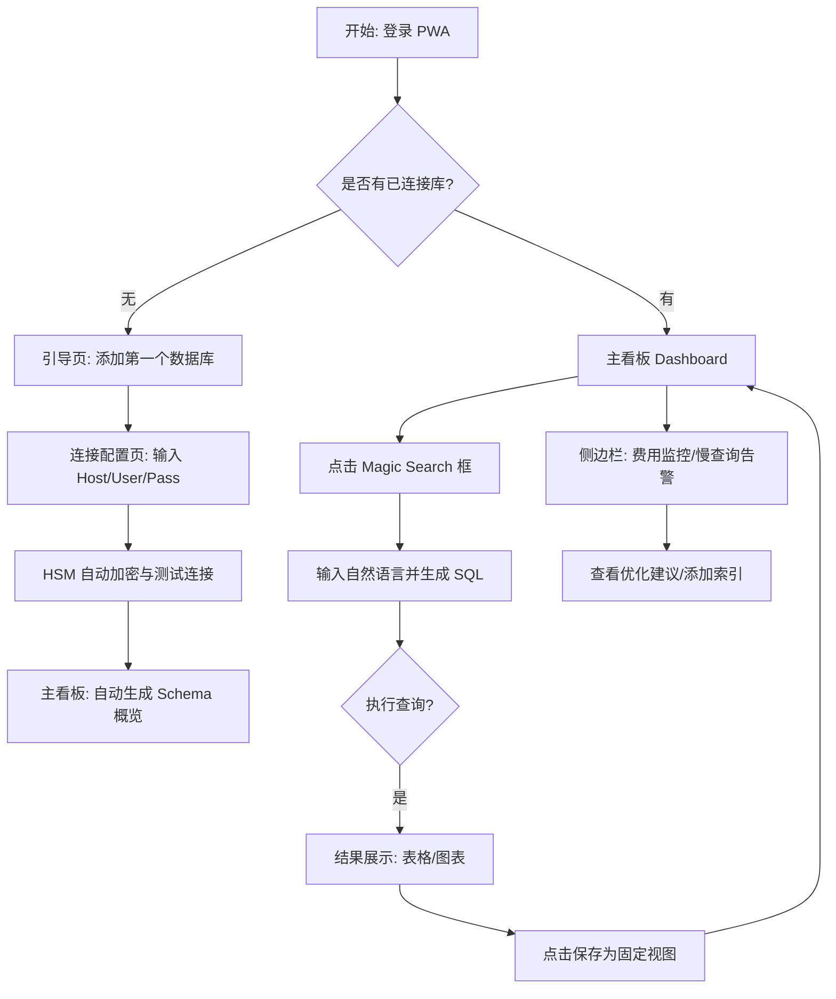

# VibeDB 详细需求规格说明书 (PRD)

## 1. 业务流程与时序逻辑

### 1.1 数据连接与 HSM 加密存储流程

**核心逻辑：** 应用后端不接触明文密码。利用“信封加密”逻辑，由用户的 HSM 系统生成密钥并存储加密后的密文（Encrypted Credential）。

### 1.2 AI 驱动的查询执行流程

**核心逻辑：** 仅在执行瞬间通过 HSM 解密，内存处理后立即释放。

---

## 2. 用户交互流程 (User Flow)

---

## 3. 功能详细说明

### 3.1 增强型 HSM 模块适配

* **信封加密：** 必须支持通过 HSM 服务进行 `encrypt` 和 `decrypt`。
* **知识拆分：** 数据库配置中的 `Host` 和 `User` 存储在主数据库，而 `Password` 的密文由 HSM 管理，实现风险隔离。
* **无状态处理：** 任何解密后的敏感信息不得写入日志或持久化存储。

### 3.2 AI SQL 生成与校验

* **Context 注入：** 发送给 AI 的上下文应包含：表名、字段名、字段类型、索引信息、以及用户预设的业务术语表（Glossary）。
* **安全沙箱 (SQL Guard)：**
* 只允许 `SELECT`、`SHOW`、`DESCRIBE`。
* 通过静态分析识别并拦截 `DELETE/DROP/UPDATE/ALTER`。
* 支持 `LIMIT` 强行限制，防止大查询打挂数据库。

### 3.3 费用与索引管理

* **TiDB/Supabase 特色适配：** 通过 API 获取查询计划（Explain Plan）。
* **告警逻辑：** 识别没有走索引的 `Full Table Scan`，并在移动端 PWA 发送推送提醒。

---

## 4. 界面设计规范 (UI/UX)

* **首页 (The Pulse)：** 顶部为 AI 搜索框，下方为瀑布流卡片。每个卡片是一个保存的 SQL 视图（数字或小趋势图）。
* **查询界面：** 采用聊天式交互（Chat-style DB Management），左边显示 AI 生成的 SQL，右边实时预览数据。
* **移动端优化：** * 底栏导航：看板、查询、告警、设置。
* 支持震动反馈：查询成功或发现慢查询时给予触觉反馈。

---

## 5. 开发约束 (给 AI Agent 的指令)

1. **API 路径：** 统一使用 `/api/v1/hsm` 路径处理加密逻辑，确保该路径的鉴权级别最高。
2. **Schema 缓存：** 数据库结构应存储在本地 Redis 或 KV 中，有效期 1 小时，避免频繁扫描。
3. **D1 适配器：** 针对 Cloudflare D1，使用 `https://api.cloudflare.com/client/v4/accounts/.../d1/database/.../query` 进行远程调用。
4. **PWA 兼容性：** 必须包含 `manifest.json` 和 `service-worker.js`，确保在 Android/iOS 下均能“添加到主屏幕”。
